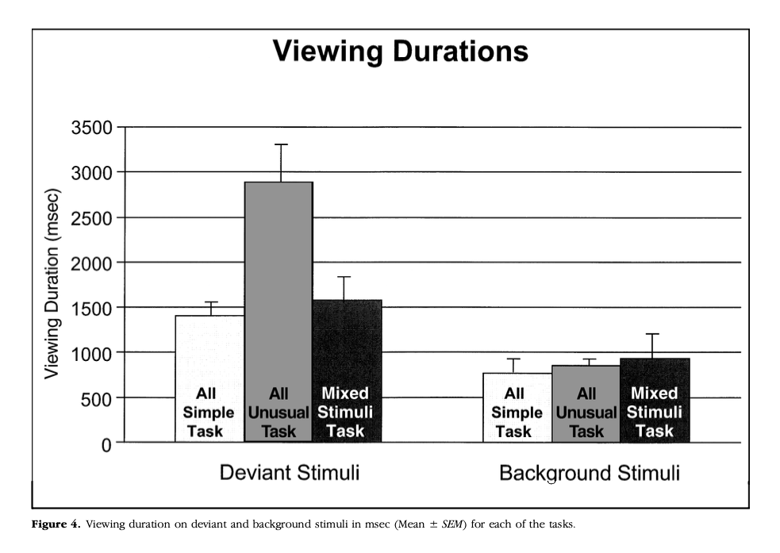

<!-- Replication reports should all use this template to standardize reporting across projects.  These reports will be public supplementary materials that accompany the summary report(s) of the aggregate results. -->

Link to [github](https://github.com/psych251/daffner2000)

Link to [experiment](https://web.stanford.edu/~anjiecao/daffner2000/experiment/experiment.html)

## Proposal 

This particular experiment is chosen because I wanted to test the plausibility of using a subject-controlled visual oddball paradigm (VOP) in a web-based experiment, in the hope of using it as an avenue to explore factors influencing people's looking time. In the infant literature, looking time is an extremely valuable measurement due to infants' limited behavioral repertoire.  Although it has been taken as indices for many perceptual and cognitive constructs, the field has not agreed on the best interpretations for looking time. The same results are often open to different interpretations, some even leading to opposite conclusions. This contention is due to the underexplored underlying mechanisms responsible for infants' looking duration toward different stimuli. But due to the difficulty of recruiting infants participants, it is often quite challenging, if not impossible, to reach a sufficient sample size for well-powered analysis. In my project, I am hoping to first develop an analog paradigm in adults to explore the different factors responsible for looking time, and eventually import the insights back to the infant literature. VOP is one promising candidate for such analog. In Daffner et al. (2000), the researchers used this paradigm to show that adult viewing time was influenced by the complexity of the visual stimuli and the amount of exposure they received. These two factors were also considered to be highly relevant to infants' looking time (Hunter & Ames, 1988). As a result, this paper was chosen. 

The stimuli were a set of unique figures. They either came from a set of simple geometric shapes (simple), or a collection of unusual/unfamiliar figures (unusual). Each participant was tested in three tasks, the order of which was counterbalanced across participants. The three tasks were identical in the procedure but differed in the compositions of the stimuli.  Each task contains 250 figures, presented in five blocks of 50 figures. Blocks were separated by a brief break, and tasks were separated by a longer break. In a given task, there are three types of stimuli in the 250 figures: background (175 out of 250, 70% frequency), target (37~ out of 250, about 15% frequency), and deviant (38 out of 250, about 15% frequency). The three tasks are All Simple Task, All Unusual Task, and the Mixed Stimuli Task. In the All Simple Task, background, target, and deviant stimuli all came from the simple geometric shapes set. In the All Unusual Task, all came from the unusual figure set. In the Mixed Stimuli Task, the background and target came from the unusual setting and the deviant came from the geometric set. In all three tasks, participants were instructed to view the figures on the screen. They were told that they can "look at each picture for however long or short they liked"(Daffner et al., 2000, pg 402). When they were done viewing a picture, they can push a button and triggered the onset of the next stimulus. Each stimulus was presented for a minimum of 600 msec. Two stimuli were separated by an interval ranged between 800 msec and 1300 msec. In the original study, they were also told to press a foot pedal when seeing the target stimuli because they served as "Sequence Markers" to help participants keep track of the progress of the experiments. In this replication, pressing the foot pedal would be substituted with a different key on the keyboard. 

There are two potential challenges for replicating this study. First, the accuracy of the results. The web-based experiment can be noisier than a laboratory experiment when other things are being equal. The nature of this experiment calls for recording accurate response time (the average looking time is on the scale of milliseconds). In response to this challenge, I am hoping to use the "jspsych-psychophysics" plugin, which can deliver stimuli with more accurate onset time (Kuroki, 2000). Second, the engagement of participants. The original study tested participants in the laboratory setting with EEG caps. Naturally, they were less likely to be distracted and more likely to remain engaged throughout the experiment. It is unclear whether the participants in the online experiment would remain at the same level of engagement throughout. Web-version may need additional incentives in-between block or task to keep participants motivated. 

Link to the [repo](https://github.com/psych251/daffner2000)

Link to the [paper](https://github.com/psych251/daffner2000/blob/master/original_paper/daffner2000.pdf) 


## Introduction

<!-- [No abstract is needed.]  Each replication project will have a straightforward, no frills report of the study and results.  These reports will be publicly available as supplementary material for the aggregate report(s) of the project as a whole.  Also, to maximize project integrity, the intro and methods will be written and critiqued in advance of data collection.  Introductions can be just 1-2 paragraphs clarifying the main idea of the original study, the target finding for replication, and any other essential information.  It will NOT have a literature review -- that is in the original publication. You can write both the introduction and the methods in past tense.   -->


In Daffner et al., (2000), the authors used a subject-controlled visual oddball paradigm (VOP) to test healthy adult participants' viewing time toward stimuli. Participants were instructed to look at pictures for as long as they wanted. They were also told to press a foot pedal when a "target stimulus" occurred on the screen. With a within-subject design, the experiment manipulated the visual complexity and occurring frequencies of the stimuli. There were three tasks for each participant. In each task, the participants viewed 250 pictures across five blocks. Of the 250 pictures, 70% of them were the background stimulus, which was one selected figure repeatedly appeared. 15% of the pictures were the target stimulus. The target stimulus had a similar level of visual complexity as the background stimuli. Like background stimuli, it also repeatedly appear. the participants were told to press a foot pedal upon seeing them. The remaining 15% of the pictures were the deviant stimuli, which were a unique set of figures, each appeared only once on the screen. The stimuli were drawn from two groups of stimuli, one with high visual complexity (unusual) and the other with low visual complexity (simple). The three tasks differed in the stimuli groups for the background, the target, and the deviant stimuli. In the "All simple task" and "All unusual task", the three categories of stimuli were all drawn from the simple group or the unusual group. The "Mixed stimuli task" drawn the background and the target stimuli from the complex group, and the deviant stimuli from the simple group. The authors found: a) an interaction effect between task and stimulus type. Participants spent longer time looking at the unusual deviant stimuli in the All Unusual task than the simple deviant stimuli in the All simple task and the Mixed Stimuli task. b) a main effect of stimulus type. Across all three tasks, the participants looked longer at the deviant stimuli than the background stimuli. and c) a main effect of task type. In the All simple task, the participants looked shorter at the background stimuli comparing to when they were looking at the background stimuli in the All unusual task and the Mixed stimuli task. 

These three findings will also be the target findings for the current replication. Note that there would be one crucial design difference in the current replication, in addition to the format difference: the current replication includes an additional task. The three tasks of the original design belong to a two (target and background versus deviant) by two (simple versus unusual) design. Since the goal of the current replication is to test the feasibility of this testing paradigm, I decided to include the omitted design from the two by two matrix. The fourth, "Mixed stimuli with the complex deviant task", mirrored the components of the "Mixed task", such that I will draw the background and target stimuli from the simple stimuli group and the deviant from the unusual group. This addition of new task leads to the predictions as following: a) in the interaction effect, we should see participants in the mixed stimuli with complex deviant tasks look similarly long at the deviant stimuli as in the All Complex task. The deviant stimuli in both tasks should have longer looking time than the deviant stimuli in the All Simple and Mixed tasks. b) The main effect applies to the new task as well, such that participants also looked longer at the deviant stimuli than the background stimuli. c) the participants in the new task should show a similar looking pattern like the ones in the All simple task, such that they looked shorter at the background stimuli comparing to when they were looking at the rest of the two tasks. 


## Methods

### Power Analysis
...haaaaalp
Original main findings: 
  - task by stimulus interaction 
  - Unusual deviant in all unusual longer than simple deviant in all simple task OR the mixed stimuli tasks
  - no diffrence in viewing duration on the simple deviant in the latter two tasks 
  - main effect of stimulus type 
  - viewing duration shorter on the simple background stimuli in the mixed stimuli task 
  
+ Original Stats measured from plot   
```{r}
library(rpsychi)
deviant_simple_mean <- (85.9 / 31.59) * 500
deviant_unusual_mean <- (181.44 / 31.59) * 500
deviant_mixed_mean <- (98.88 / 31.59) * 500

deviant_simple_sem <- (9.92 / 31.59) * 500
deviant_unusual_sem <- (26.1 / 31.59) * 500
deviant_mixed_sem <- (15.6 / 31.59) * 500


bkgd_simple_mean <- (48.02 / 31.59) * 500
bkgd_unusual_mean <- (53.6 / 31.59) * 500
bkgd_mixed_mean <- (58.53 / 31.59) * 500

bkgd_simple_sem <- (10.52 / 31.59) * 500
bkgd_unusual_sem <- (4.27 / 31.59) * 500
bkgd_mixed_sem <- (16.94 / 31.59) * 500


```


Original effect size, power analysis for samples to achieve 80%, 90%, 95% power to detect that effect size.  Considerations of feasibility for selecting planned sample size.

### Planned Sample

<!-- Planned sample size and/or termination rule, sampling frame, known demographics if any, preselection rules if any. -->

The planned sample size is [??? depends on the power analysis]. They should be healthy adults without any known history of neurological problems or learning disabilities.


### Materials

<!-- All materials - can quote directly from original article - just put the text in quotations and note that this was followed precisely.  Or, quote directly and just point out exceptions to what was described in the original article. -->

> “All stimuli either came from a set of simple geometric figures or a set of unusual/unfamiliar figures (e.g., fragmented or ‘‘impossible’’ objects), many of which were from the collection of drawings that have been used by Kosslyn et al. (1994) and Kroll and Potter (1984). The particular stimuli assigned to each task were randomly chosen from the two sets of figures noted above.” (Daffner et al., 2000, pg 402)

Note: 
- The stimuli used in the current replication is from the set of novel objects stimuli normed by Lewis & Frank (2016). The simple geometric figures were substituted with novel objects with complexity score in the lowest 1.5 quintile. The "unusual figures" were substituted with the novel objects in the highest 1.5 quintiles. 


### Procedure	

<!-- Can quote directly from original article - just put the text in quotations and note that this was followed precisely.  Or, quote directly and just point out exceptions to what was described in the original article. -->

> "Subjects were introduced to the laboratory setting and, following electrode placement (see below), were seated in front of a computer monitor in a sound attenuated room. Subjects were told that the experiment involved the study of brain wave responses as they looked at different kinds of pictures. They were informed that they would be viewing a set of pictures and that they could look at each picture for however long or short they liked. They controlled the viewing duration by a button press that triggered the onset of the next stimulus. They were explicitly informed that they would not be asked questions about the pictures at the conclusion of the experiment. Subjects also were asked to respond to the designated target stimulus by pressing a foot pedal (ipsilateral to the button press). The targets were called ‘‘Sequence Markers’’ and subjects were told that they were included in the task to help the experimenters keep track of where they were in the sequence of drawings. As with the other stimuli, subjects controlled how long they looked at each of the targets. The 250 stimuli for each task were presented in five blocks of 50 stimuli each, with a brief break between each block. Longer breaks were taken between each task. The laterality of the responding hand and foot was counter- balanced across subjects. Although viewing durations were calculated by subtracting the stimulus onset time from the button press time, all stimuli were displayed for a minimum duration of 600 msec. The interval between the offset of one stimulus and the onset of the next stimulus ranged between 800 and 1300 msec." (Daffner et al., 2000, pg 402 - 403)

Note: Because the current replication will be done online, I made modifications as following

- The current replication includes four tasks instead of three for reasons explained in the introduction section. 
- The length of each task is shortened to 49 trials. This is to make sure that participants can go through the entire study via the online format. 
- A practice phase is added to familiarze the participants with the test-setups. 
- Also to adapt to the online format, the minimum viewing duration is reduced from 600 msec to 200 msec. 
- Instead of pressing the foot pedal, the participants were prompted to press the space bar when seeing the target stimuli. When the participants press the space bar in the target trial, the fixation window's border will flash red to indicate the participant has reacted. Participants can press the space bar in other trials as well but they will not see the visual feedback. 


### Analysis Plan

<!-- Can also quote directly, though it is less often spelled out effectively for an analysis strategy section.  The key is to report an analysis strategy that is as close to the original - data cleaning rules, data exclusion rules, covariates, etc. - as possible.   -->

- Data cleaning rules: the script for extracting and aggregating relevant data from the raw CSV will be available in the SI. 
- Data exclusion rules: In Daffner et al.(2000) the exclusion rule is based on criteria related to the EEG measurement, which is unobtainable with the online format. The current replication experiment has both participant-level exclusion criterion and the trial-level exclusion criterion. On the participant level, a participant is excluded from the final analysis if a) one presses the space bar for more than non-target 25% trials or b) one does not press the space bar for more than 25% of the target trial or c) indicate one has a history of neurological disorder or learning disabilities or d) missing data from more than 25% trials after applying the trial-based exclusion rule. On the trial-level, a trial is excluded if the RT is more than 3 standard deviation away from the log-transformed scale.

**Clarify key analysis of interest here**  You can also pre-specify additional analyses you plan to do.

- 2 stimuli type x 4 task type repeated measures ANOVA
- Mixed effects linear regression: log(RT) ~ stimuli_type * block + (trial | participant)
- Exploratory analysis: 
  - Demographics: log(RT) ~ age + (trial | participant); log(RT) ~ age + stimuli_type * block + (trial | participant); log(RT) ~ education_level + (trial | participant); log(RT) ~ education_level + stimuli_type * block + (trial | participant)
  - Target reaction time: log(target_rt) ~ target_type * block + (trial | participant)
  - Number of consecutive background stimuli before deviant: log(RT_at_deviant) ~ number_of_consecutive_background_before_deviant + background_type * block + (trial | participant);  
  - distance to the target trial before deviant: log(RT_at_deviant) ~ number_of_trials_between_deviant_and_last_target + background_type * block + (trial | participant);   - effect of stimuli repetition: log(rt) ~ trial_type * block + trial_num * block_num + trial_num * trial_type*num_times_stimulus_seen

### Differences from Original Study

Explicitly describe known differences in sample, setting, procedure, and analysis plan from the original study.  The goal, of course, is to minimize those differences, but differences will inevitably occur.  Also, note whether such differences are anticipated to make a difference based on claims in the original article or subsequent published research on the conditions for obtaining the effect.

- **Sample differences**: the original study tested 24 right handed undergraduate students with a mean age 20.54 years. I anticipated the current sample will have a higher mean age and a wider range of age. Because of the within-subject design, the age should not alter the claimed effects. 
- **Setting differences**: the original study was conducted in the lab with the participants wearing EEG caps. The current setting is an online browser-based experiment. The setting difference can lead current participants to be less motivated and engaged. It can increase the noise in the data. 
- **Procedure differences**: There are three differences. First, the original study asks the participant to press a foot pedal as a response to the target trial, and the current study changes it to be the space bar and also add visual feedback when the response is provided. Second, the original study includes three tasks and the current includes four. Neither of the change should make a difference in the effects. Third, the length of the task is cut to about the quarter of the origianl length. 
- **Analysis differences**: for the confirmatory analysis, there is no difference. The exclusion rule is changed because the current replication effort will not collect EEG data. 


<!-- ### Methods Addendum (Post Data Collection) -->

<!-- You can comment this section out prior to final report with data collection. -->

<!-- #### Actual Sample -->
<!--   Sample size, demographics, data exclusions based on rules spelled out in analysis plan -->

<!-- #### Differences from pre-data collection methods plan -->
<!--   Any differences from what was described as the original plan, or “none”. -->


## Results


### Data preparation

Data preparation following the analysis plan.
Scripts for preprocessing data can be seen [here](https://github.com/psych251/daffner2000/tree/master/writeup/daffner2000_analysis/script)

```{r message=FALSE, warning=FALSE, include=T}

library(tidyverse)
library(here)
library(rstatix)
library(lme4)
library(DT)
library(jsonlite)
library(tidyverse)
library(kableExtra)
source(here("writeup/daffner2000_analysis/script/00_read_raw_data.R"))
source(here("writeup/daffner2000_analysis/script/01_apply_exclusion_criteria.R"))
source(here("writeup/daffner2000_analysis/script/02_tidy_data.R"))

RAW_DATA_DIR <- here("writeup/daffner2000_analysis/raw_data/")
AGGREGATED_DATA_PATH <- here("writeup/daffner2000_analysis/processed_data/aggregated_data.csv")
PROCESSED_DATA_PATH <- here("writeup/daffner2000_analysis/processed_data/processed_data.csv")

####Aggregate across participants, clean up demographic fields
aggregate_data(RAW_DATA_DIR, AGGREGATED_DATA_PATH)


####Import data 
data_with_demog <- read_csv(AGGREGATED_DATA_PATH)

#### Data exclusion / filtering
# participants level exclusion
filtered_data <- filter_demog(data_with_demog)
filtered_data <- filter_spacebar(filtered_data)
filtered_data <- filter_trial_variation(filtered_data)
filtered_data <- filter_too_many_outliers(filtered_data)
#trial level exclusion
filtered_data <- filter_outlier_trial(filtered_data)  

#### Prepare data for analysis - create columns etc.
d <- tidy_data(filtered_data,PROCESSED_DATA_PATH) # this also writes

```


### Confirmatory analysis
preview data 
```{r}
d %>% datatable()
```
*Side-by-side graph with original graph is ideal here*
Confirmatory analysis: 
```{r message=FALSE, warning=FALSE}
anova_test(data = d, 
           formula = trial_looking_time ~ trial_stimulus_complexity * block,
           dv = trial_looking_time)
```

```{r}
d %>% 
  filter(trial_stimulus_type != "target") %>% 
  group_by(trial_stimulus_type, block) %>% 
  summarize(
    mean = mean(as.numeric(trial_looking_time), na.rm = TRUE),
    sd = sd(as.numeric(trial_looking_time), na.rm = TRUE), 
    n = n(),
    ci_range_95 =  qt(1 - (0.05 / 2), n - 1) * (sd/sqrt(n)),
    ci_lower = mean - ci_range_95,
    ci_upper = mean + ci_range_95
  ) %>% 
  ggplot(aes(x = block, y = mean)) + 
  geom_pointrange(aes(ymin = ci_lower, ymax = ci_upper)) +
  facet_wrap(~trial_stimulus_type) + 
  theme(axis.text.x = element_text(angle = 90, vjust = 0.5, hjust=1))
```
Original Plot: 



    

### Exploratory analyses
```{r}
d
```

- Mixed effects linear regression: log(RT) ~ stimuli_type * block + (trial | participant)

```{r}
lmer(log(trial_looking_time) ~ trial_stimulus_type * block + (trial_num | subject), 
     data = d)
```

  - Demographics: log(RT) ~ age + (trial | participant); log(RT) ~ age + stimuli_type * block + (trial | participant); log(RT) ~ education_level + (trial | participant); log(RT) ~ education_level + stimuli_type * block + (trial | participant)
  - Target reaction time: log(target_rt) ~ target_type * block + (trial | participant)
  - Number of consecutive background stimuli before deviant: log(RT_at_deviant) ~ number_of_consecutive_background_before_deviant + background_type * block + (trial | participant);  
  - distance to the target trial before deviant: log(RT_at_deviant) ~ number_of_trials_between_deviant_and_last_target + background_type * block + (trial | participant);   - effect of stimuli repetition: log(rt) ~ trial_type * block + trial_num * block_num + trial_num * trial_type*num_times_stimulus_seen


## Discussion

### Summary of Replication Attempt

Open the discussion section with a paragraph summarizing the primary result from the confirmatory analysis and the assessment of whether it replicated, partially replicated, or failed to replicate the original result.  

### Commentary

Add open-ended commentary (if any) reflecting (a) insights from follow-up exploratory analysis, (b) assessment of the meaning of the replication (or not) - e.g., for a failure to replicate, are the differences between original and present study ones that definitely, plausibly, or are unlikely to have been moderators of the result, and (c) discussion of any objections or challenges raised by the current and original authors about the replication attempt.  None of these need to be long.
